# Screens: first launch and team creation

What a new player sees, in order. For the rules behind these steps see [How the game works](../00-start-here/how-the-game-works.md) and the [New player guide](../00-start-here/new-player-guide.md).

## 1. Loading and sign-in

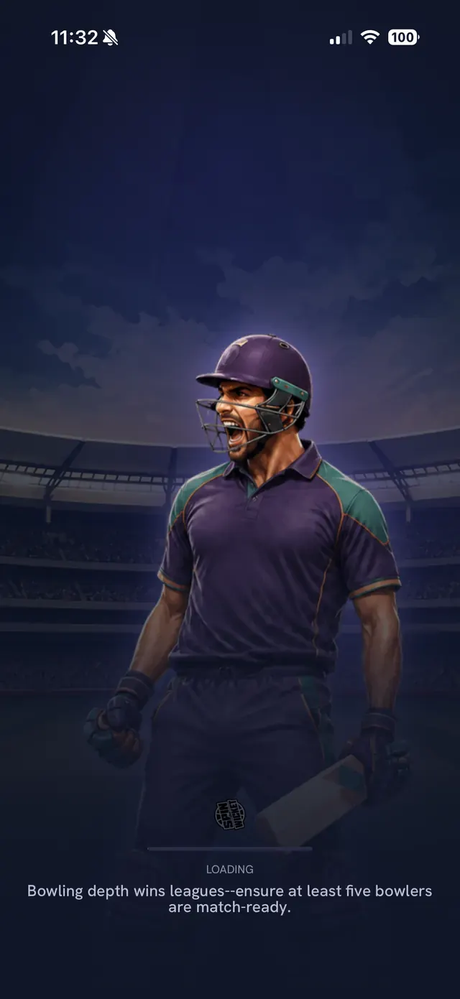

**What you see:** the loading screen with a loading bar and a short tip. This one says "Bowling depth wins leagues - ensure at least five bowlers are match-ready." Tips change.

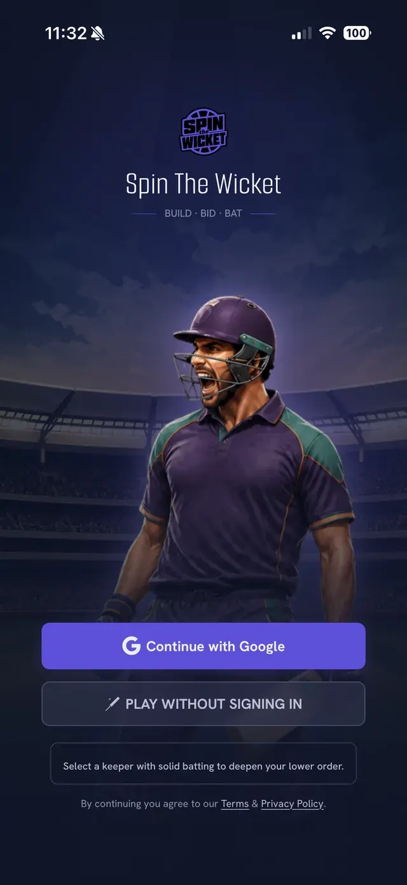

**What you see:** the Spin The Wicket logo with the tagline **BUILD · BID · BAT**. Two buttons: **Continue with Google** and **Play without signing in**. Below them are a short tip and a note that continuing means you agree to the Terms and Privacy Policy.

## 2. Being placed in a league

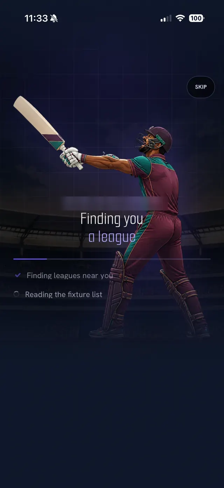

**What you see:** a welcome line with your name, the text "Finding you a league", and two progress steps: "Finding leagues near you" and "Reading the fixture list". A **Skip** button sits at the top right.

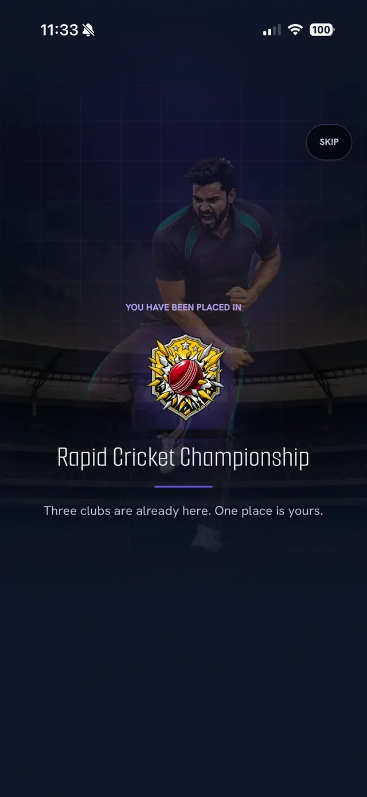

**What you see:** "You have been placed in" followed by the league badge and name (here Rapid Cricket Championship) and the line "Three clubs are already here. One place is yours."

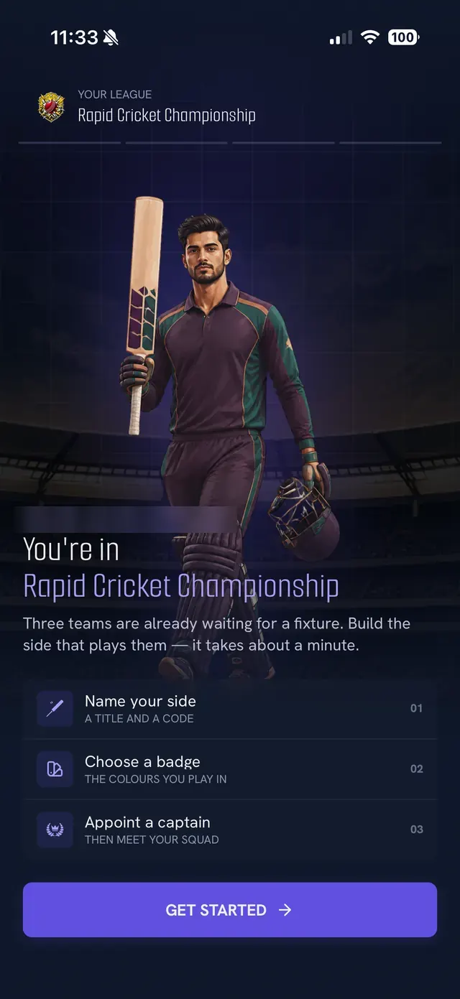

**What you see:** "You're in" with the league name, a short message (three teams are waiting for a fixture; building your side takes about a minute) and three steps: **01 Name your side** (a title and a code), **02 Choose a badge** (the colours you play in), **03 Appoint a captain** (then meet your squad). The button is **Get Started**.

## 3. The team wizard (4 steps)

The progress bar at the top shows the step (for example 02 / 04). You can go back with the arrow.

**Step 01 - Name your side.** You type a team name and a short code (for example "Deep Chaos XI" and "DCX"). There is no screenshot for this step.

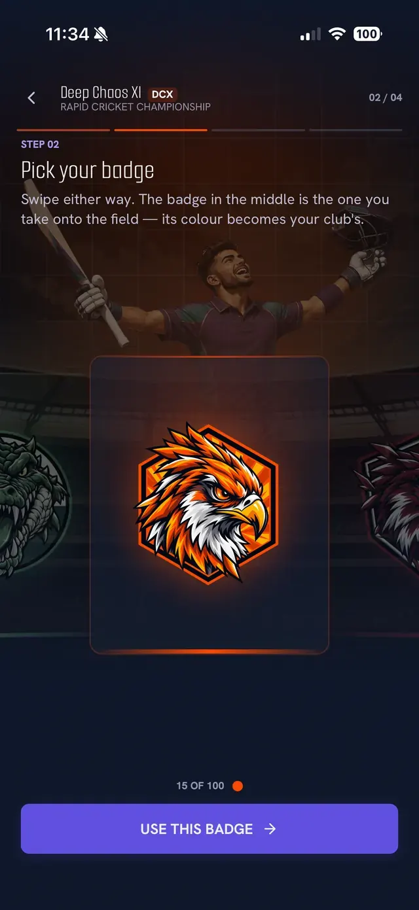

**Step 02 - Pick your badge:** swipe left or right through the badges. The badge in the middle is the one you take onto the field, and its colour becomes your club colour. A counter such as "15 of 100" shows which badge you are on. Tap **Use this badge**.

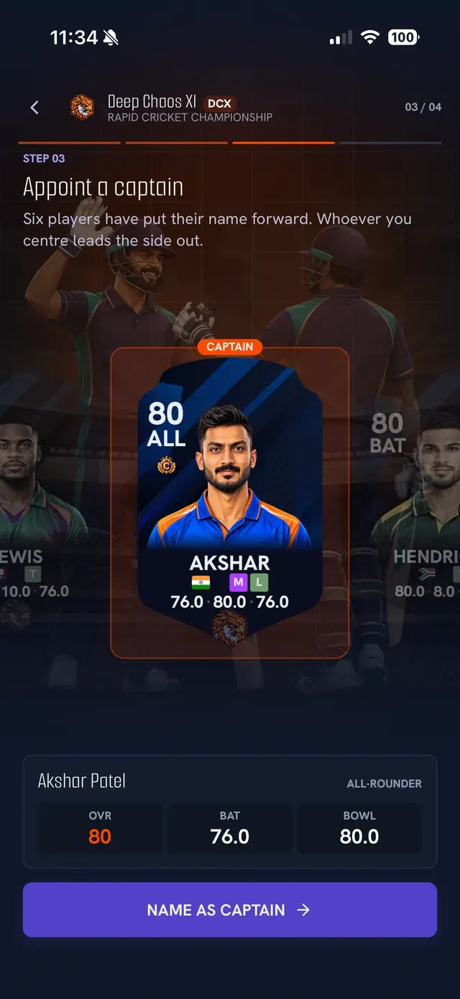

**Step 03 - Appoint a captain:** "Six players have put their name forward. Whoever you centre leads the side out." Swipe through the candidate cards (each shows rating, role, and the batting and bowling levels underneath). The card in the middle gets the **Captain** tag. Tap **Name as captain**.

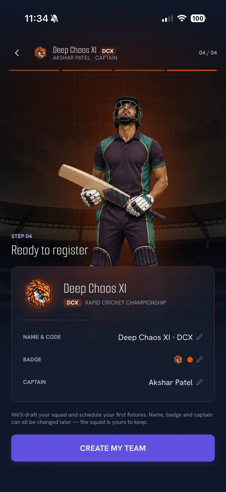

**Step 04 - Ready to register:** a summary of **Name and code**, **Badge** and **Captain**, each with a pencil icon so you can edit it. A note says the game will draft your squad and schedule your first fixtures, and that name, badge and captain can all be changed later. The button is **Create my team**.

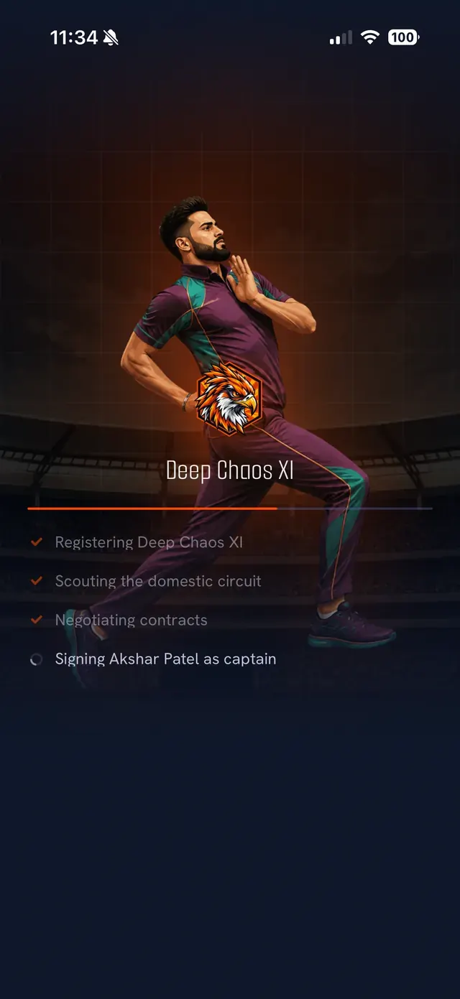

**What you see:** a short progress list: Registering your team, Scouting the domestic circuit, Negotiating contracts, Signing your captain.

## 4. Squad reveal

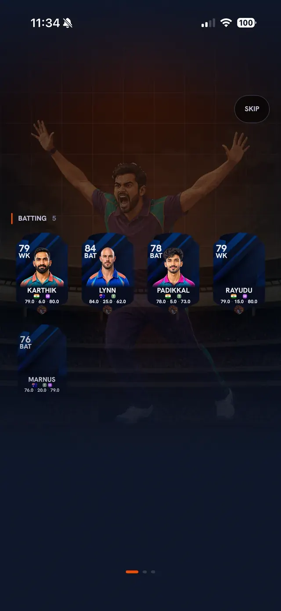

**What you see:** your starting squad appearing group by group (the first group shown is **Batting**, with wicket-keepers and batters). There is a **Skip** button.

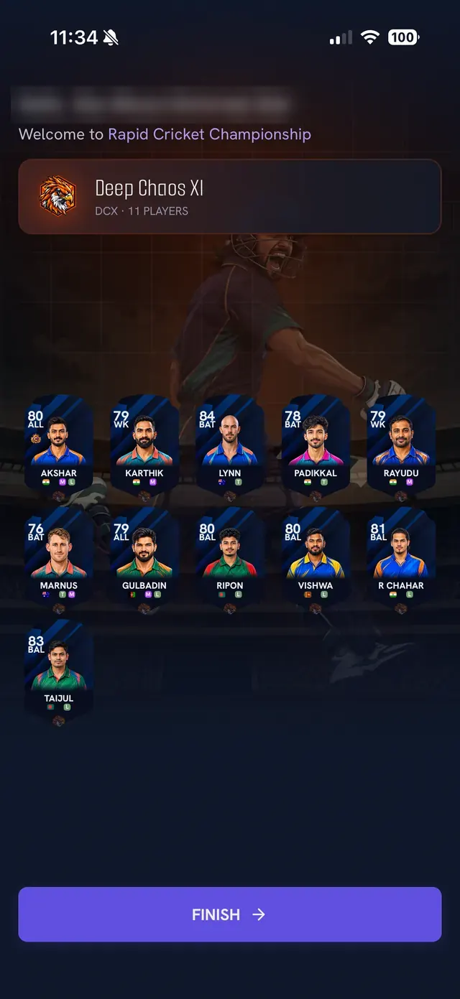

**What you see:** "Hello" and your name, the league name, your team name and code with "11 players", and all eleven player cards. Tap **Finish** to enter the app. A new team in this example started with 11 players.

## 5. Getting Started checklist

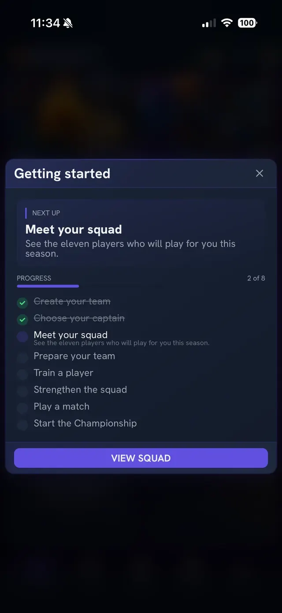

**What you see:** a **Getting started** card with a "Next up" step and a progress count (2 of 8 in this screenshot). The steps are: Create your team, Choose your captain, Meet your squad, Prepare your team, Train a player, Strengthen the squad, Play a match, Start the Championship (the last name uses the league's main tournament). Completed steps are ticked and crossed out. The button opens the screen for the next step (here **View squad**).

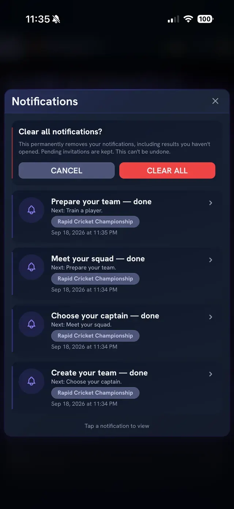

**What you see:** the **Notifications** panel (bell icon). Each completed checklist step creates a notification such as "Prepare your team - done, Next: Train a player". The top card asks "Clear all notifications?" with **Cancel** and **Clear all**; clearing removes results you have not opened, and pending invitations are kept.

## Related

[App navigation](../06-reference/app-navigation.md), [Home and navigation screens](home-and-navigation.md), [Team and player screens](team-and-player-screens.md)
