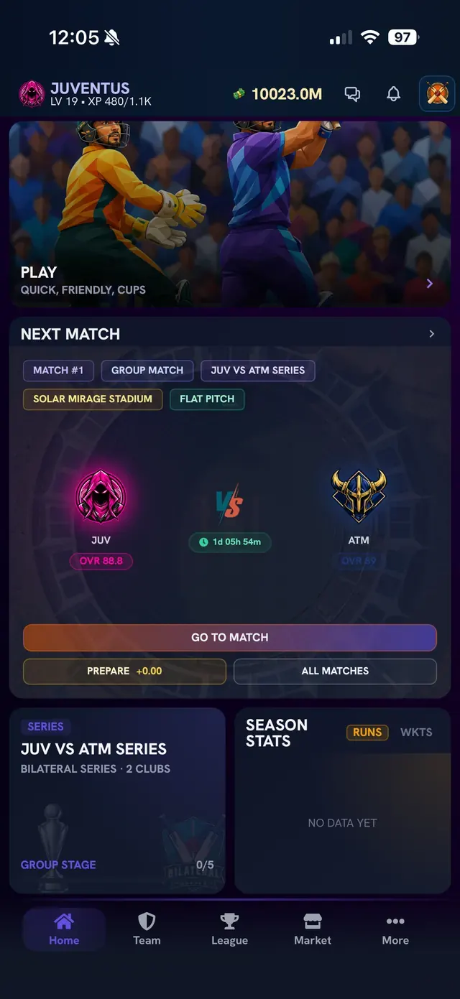
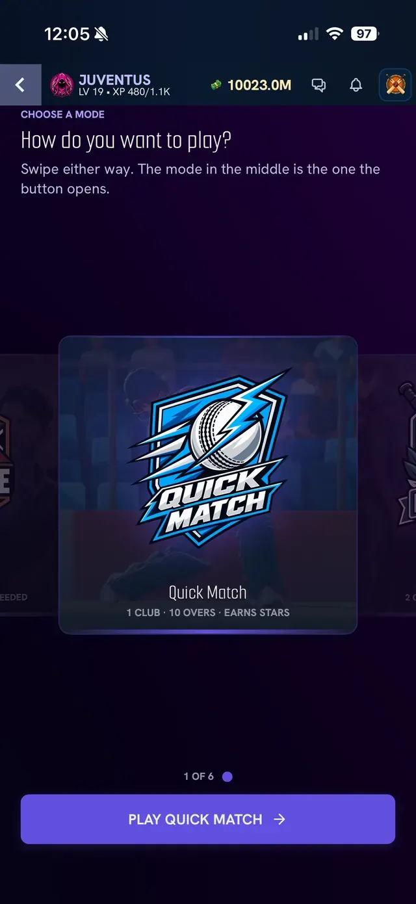
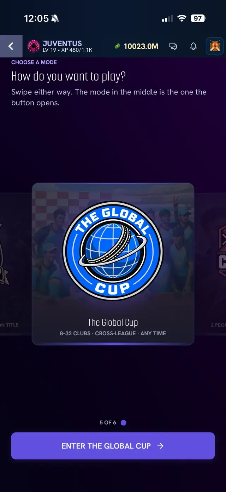
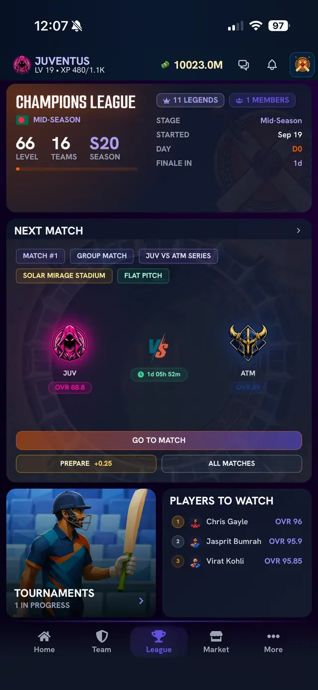
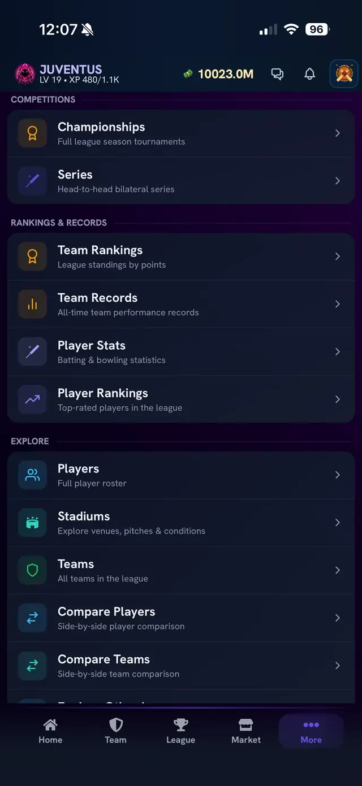

# Screens: Home, modes and the More menu

The bottom bar has five tabs: **Home, Team, League, Market, More**. See also [App navigation](../06-reference/app-navigation.md).

## Home

**What you see, top to bottom:**

- The top bar: your team crest, team name, level and XP (for example "LV 19 - XP 480/1.1K"), your coin balance, the chat icon, the notifications bell and the league badge.
- A **Play** banner ("Quick, Friendly, Cups") that opens the mode picker.
- The **Next Match** card: tags for the match number, stage, series name, stadium and pitch type; both teams' crests with overall ratings; a countdown to the match; and three buttons: **Go to match**, **Prepare** (shows the Focus Boost you have earned, for example +0.00) and **All matches**.
- A card for your active series (stage and matches played, for example 0/5) and a **Season Stats** card with **Runs / Wkts** tabs. It shows "No data yet" until you have played.
- Further down, cards for recent signings and similar events.

## Mode picker

**What you see:** "Choose a mode - How do you want to play?" Swipe left or right. The mode in the middle is the one the button opens. A counter shows your position (here "1 of 6"). The **Quick Match** card reads "1 club - 10 overs - earns stars" and the button is **Play Quick Match**.

**What you see:** the fifth mode (5 of 6) is **The Global Cup**, described as "8-32 clubs - cross-league - any time", with the button **Enter the Global Cup**. The rules of this mode are not documented yet, see [Not yet documented](../06-reference/not-yet-documented.md). Four other modes are not identified.

## League tab

**What you see:** the league card (name, number of legends and members, league level, number of teams, season such as S20, stage such as Mid-Season, start date, and a countdown to the finale), the **Next Match** card again, a **Players to Watch** list of the top-rated players, and a **Tournaments** tile ("1 in progress"). Managers who can create tournaments do it from here: see [Tournament screens](league-and-tournament-screens.md).

## More menu

**What you see:** three groups of pages.

- **Competitions:** Championships (full league season tournaments) and Series (head-to-head bilateral series).
- **Rankings and Records:** Team Rankings (league standings by points), Team Records (all-time team performance records), Player Stats (batting and bowling statistics), Player Rankings (top-rated players in the league).
- **Explore:** Players (full player roster), Stadiums (venues, pitches and conditions), Teams (all teams in the league), Compare Players (side-by-side), Compare Teams (side-by-side), and more below.

## Related

[Team and player screens](team-and-player-screens.md), [Market screens](market-screens.md), [Match day screens](match-day-screens.md)
