# Screens: tournaments, series, points tables, rankings and teams

Rules behind these screens: [Tournaments and seasons](../05-progression/tournaments-and-seasons.md), [Match formats and scoring](../03-matches/match-formats-and-scoring.md).

## Tournament list and creation

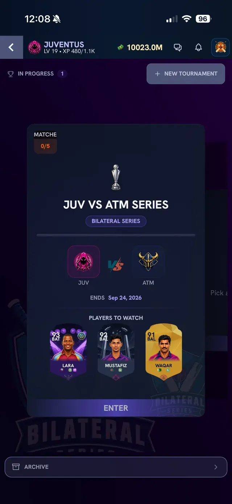

**What you see:** the **Tournaments** page with an **In progress** counter and a **New Tournament** button at the top right. Each running tournament is a card with its name, type tag (for example **Bilateral Series**), the teams, the end date, **Players to watch** and an **Enter** button. An **Archive** row at the bottom opens finished tournaments.

The **New Tournament** button opens a four-step wizard. A progress bar at the top shows the step (01 / 04 and so on) and an X closes it.

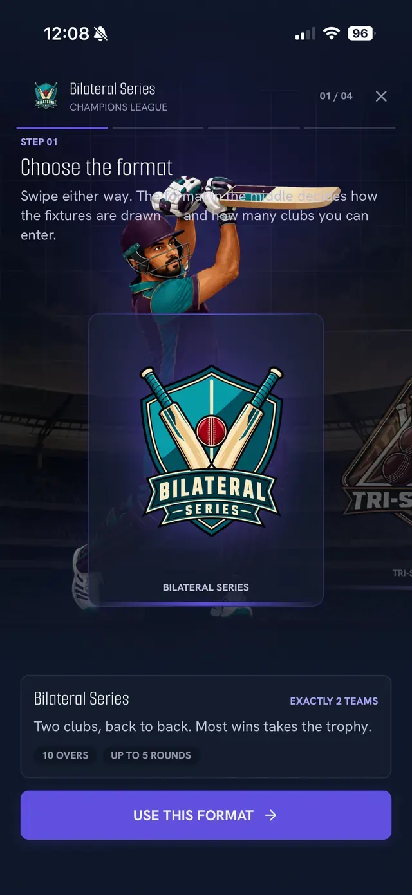

**Step 01 - Choose the format:** swipe through the formats. The one in the middle decides how fixtures are drawn and how many clubs can enter. Here **Bilateral Series** is shown: "Exactly 2 teams. Two clubs, back to back. Most wins takes the trophy." with tags **10 overs** and **Up to 5 rounds**. A **Tri-series** card is visible at the edge, and **Knockout Cup** is another format. Tap **Use this format**.

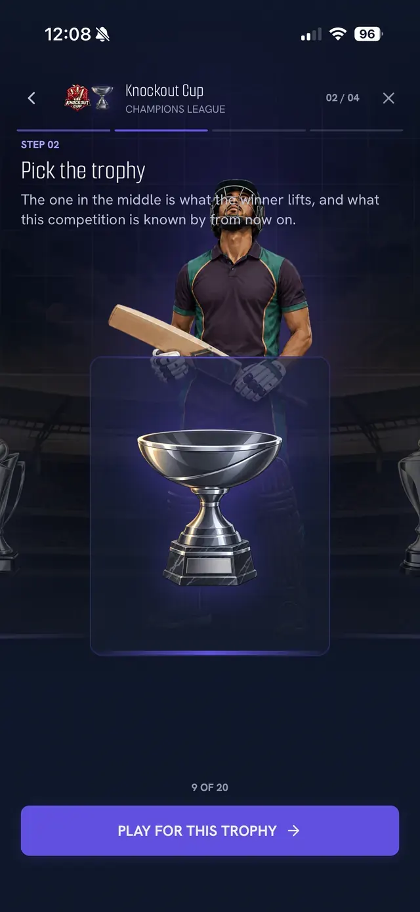

**Step 02 - Pick the trophy:** swipe through trophies (a counter such as "9 of 20"). "The one in the middle is what the winner lifts, and what this competition is known by from now on." Tap **Play for this trophy**.

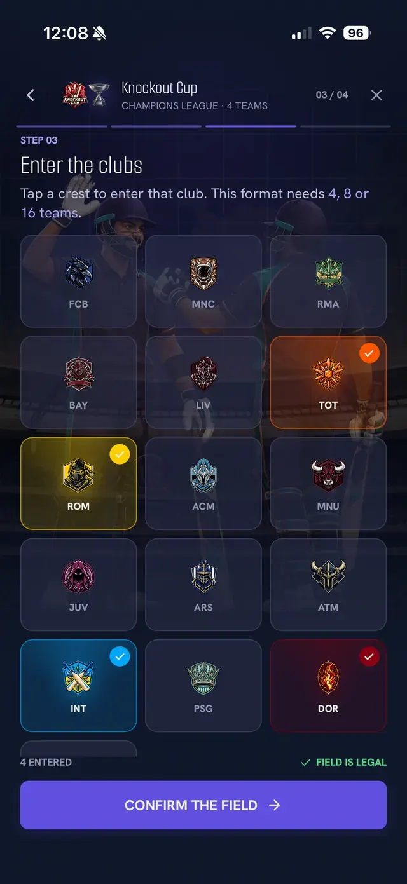

**Step 03 - Enter the clubs:** a grid of club crests. Tap a crest to enter that club. For the Knockout Cup the text says "This format needs 4, 8 or 16 teams." At the bottom a counter shows how many clubs are entered and a green **Field is legal** tick appears when the number is valid. Tap **Confirm the field**.

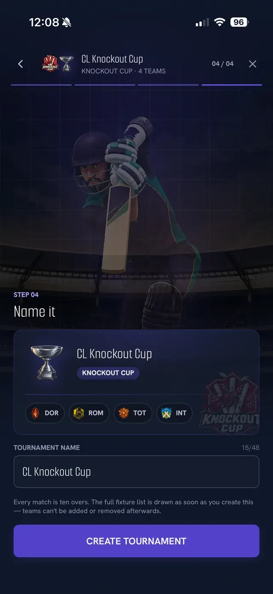

**Step 04 - Name it:** a summary card with the name, type tag and the entered clubs, a **Tournament name** box (with a character counter), and a note: "Every match is ten overs. The full fixture list is drawn as soon as you create this - teams can't be added or removed afterwards." Tap **Create tournament**.

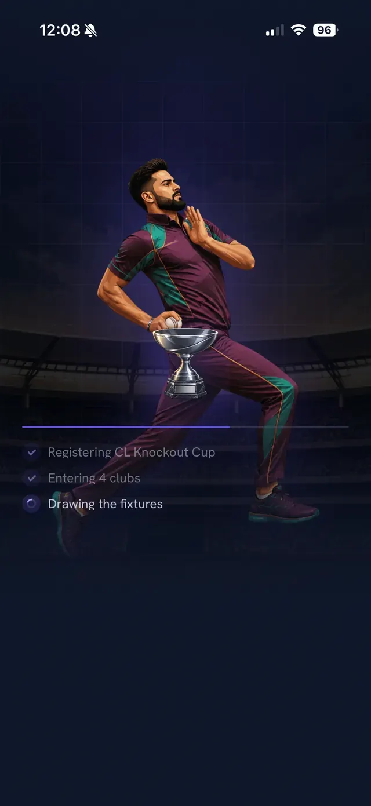

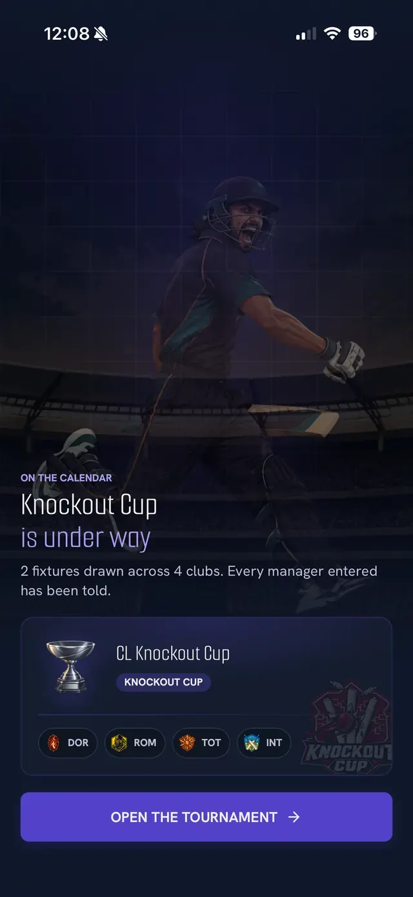

**What you see:** a short progress list (Registering, Entering clubs, Drawing the fixtures) and then "On the calendar - Knockout Cup is under way", for example "2 fixtures drawn across 4 clubs. Every manager entered has been told." The button is **Open the tournament**.

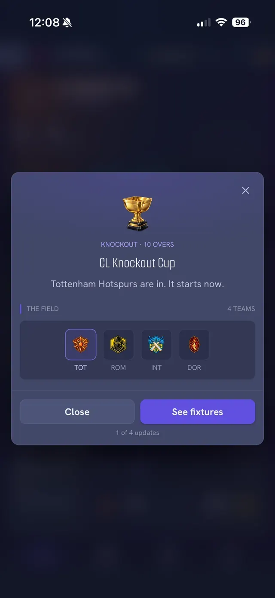

**What you see:** managers whose club is entered get a popup: "<Team> are in. It starts now." with the field of teams and the buttons **Close** and **See fixtures**. A counter like "1 of 4 updates" shows how many popups are waiting.

## Series and championship pages

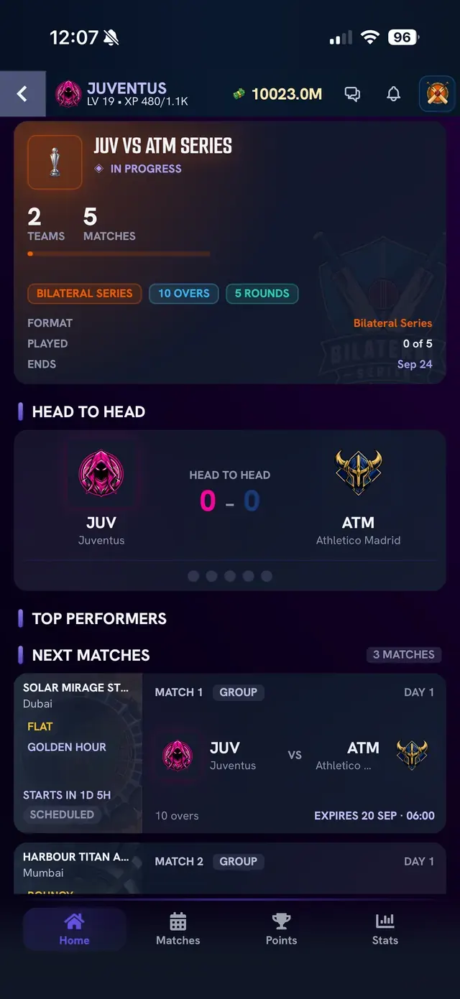

**What you see (Home tab):** the series header (name, status such as In progress, number of teams and matches, a progress bar, tags for the format, overs and rounds, then format, played and end date), a **Head to Head** card, **Top Performers**, and **Next Matches**. The bottom tabs are **Home, Matches, Points, Stats**.

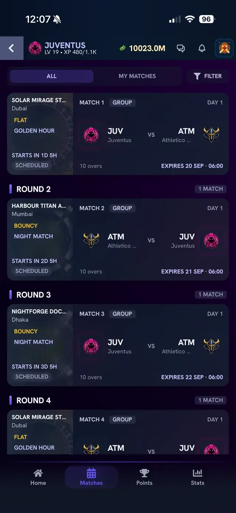

**What you see (Matches tab):** a switch between **All** and **My Matches** plus a **Filter** button. Matches are grouped by round (Round 2, Round 3 and so on). Each match card shows the stadium and city, pitch type, a conditions tag such as Golden Hour or Night Match, the two teams, "Starts in" time, the number of overs, the status (**Scheduled**) and an **Expires** date and time.

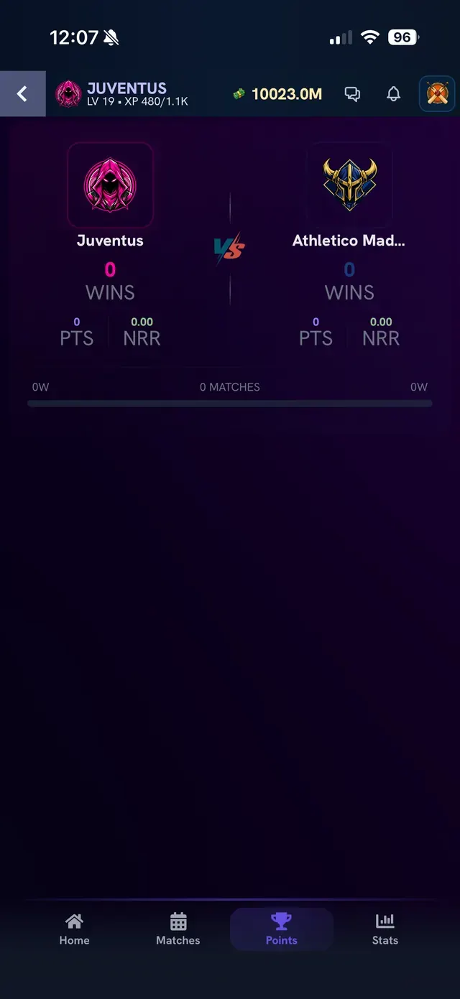

**What you see (Points tab, series):** the two clubs with wins, points and net run rate (NRR) and a bar showing matches played.

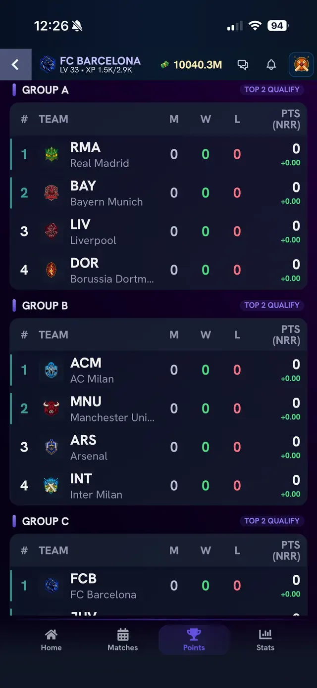

**What you see (Points tab, championship):** standings split into **Group A, B, C** and so on, each with a "Top 2 qualify" label. Columns are team, **M** (matches), **W**, **L** and **PTS (NRR)**.

## Finishing a tournament

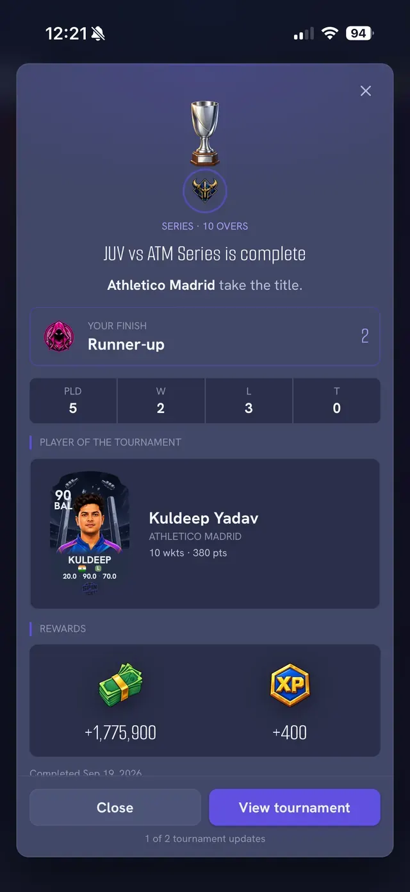

**What you see:** "<Series> is complete", the winner ("Athletico Madrid take the title"), **Your finish** (here Runner-up), your played, won, lost and tied counts, the **Player of the Tournament** card, and **Rewards** (coins and XP; in this example +1,775,900 coins and +400 XP for a runner-up in a 5-match series). Buttons: **Close** and **View tournament**.

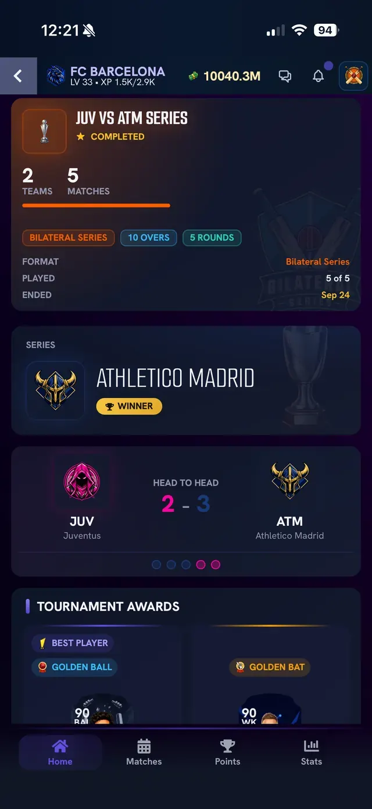

**What you see:** the series home after it ends. The status reads **Completed**, a **Winner** banner shows the champion, the head-to-head result is final, and a **Tournament Awards** section lists **Best Player**, **Golden Ball** and **Golden Bat**.

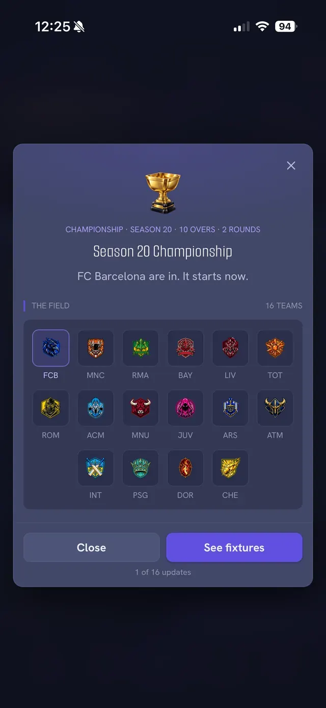

**What you see:** the same kind of popup for a season championship ("Season 20 Championship - FC Barcelona are in. It starts now.") listing the field (16 teams).

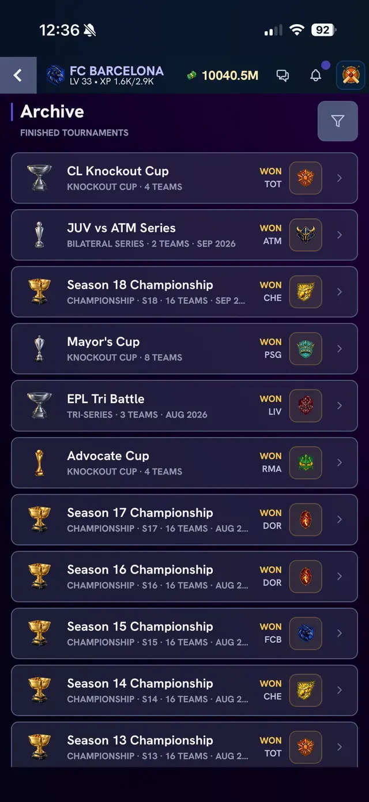

**What you see:** the **Archive** of finished tournaments. Each row shows the name, type (**Championship**, **Knockout Cup**, **Bilateral Series**, **Tri-series**), number of teams, date or season, a **Won** label with the winner's crest, and an arrow to open it. Filter button at the top right.

## Rankings

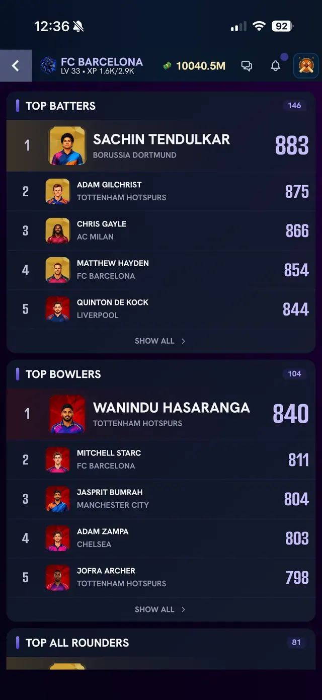

**What you see:** **Player Rankings** with sections **Top Batters**, **Top Bowlers** and **Top All Rounders**, each with a count of ranked players, the top five with their team and a score, and a **Show all** link.

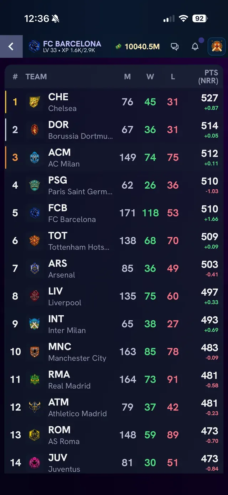

**What you see:** **Team Rankings**, the league standings for all teams. Columns are rank, team, **M**, **W**, **L** and **PTS (NRR)**. The top three rows have coloured markers.

## Teams

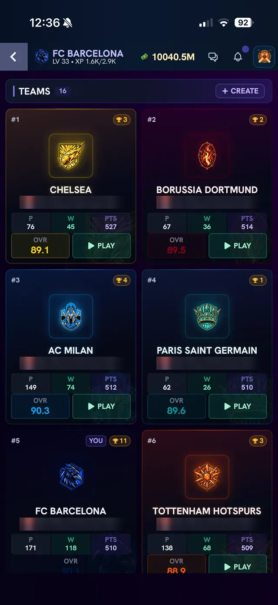

**What you see:** the **Teams** page with a team count and a **Create** button. Each team is a card with its rank, number of trophies, crest, name, matches played, wins, points and team **OVR**, plus a **Play** button (friendly match). Your own team has a **You** tag. Owner names are hidden in this screenshot.

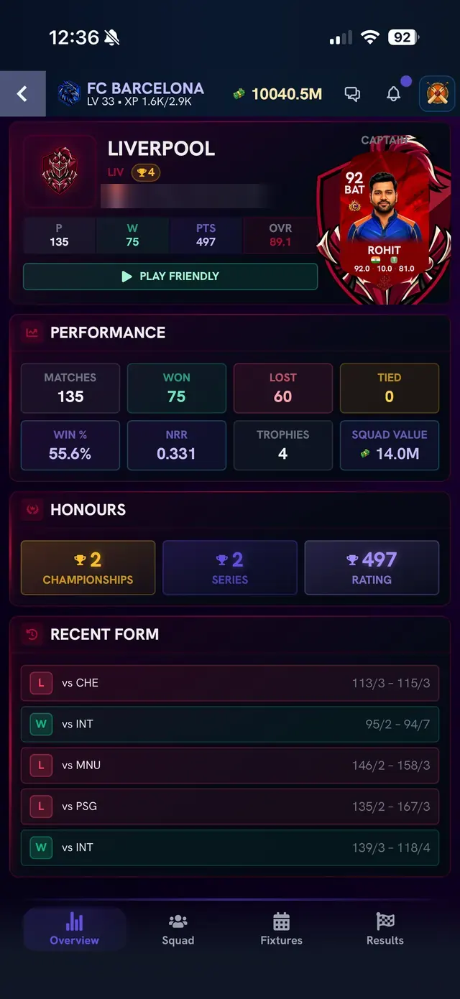

**What you see (Overview tab):** the team header (name, short code, trophy count, captain card, P, W, PTS, OVR and a **Play friendly** button), a **Performance** panel (matches, won, lost, tied, win %, NRR, trophies, squad value), **Honours** (championships, series, rating) and **Recent form** with the last five results and scores. The bottom tabs are **Overview, Squad, Fixtures, Results**.

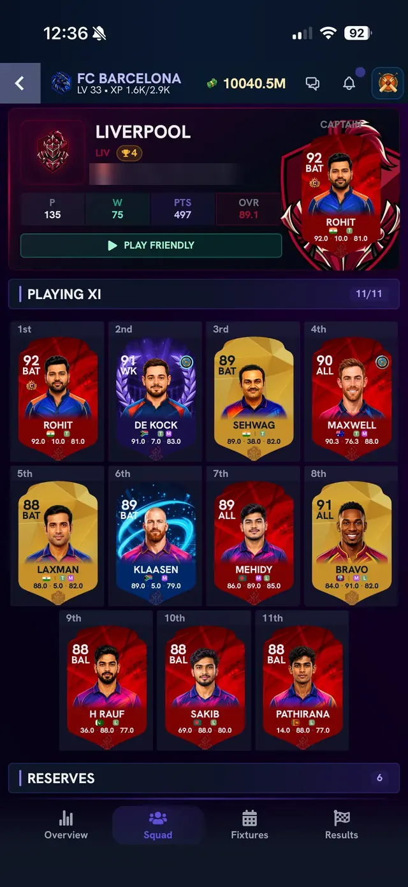

**What you see (Squad tab):** the team's Playing XI as 11 cards in batting order (1st to 11th) and a **Reserves** section with the number of reserves.

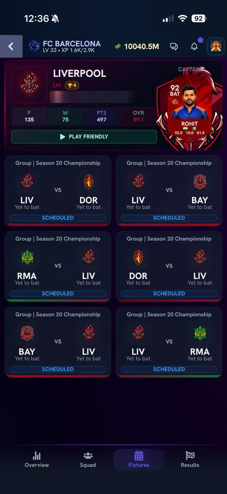

**What you see (Fixtures tab):** scheduled matches for that team, each labelled with the stage and tournament name, the two teams, "Yet to bat" and a **Scheduled** tag.

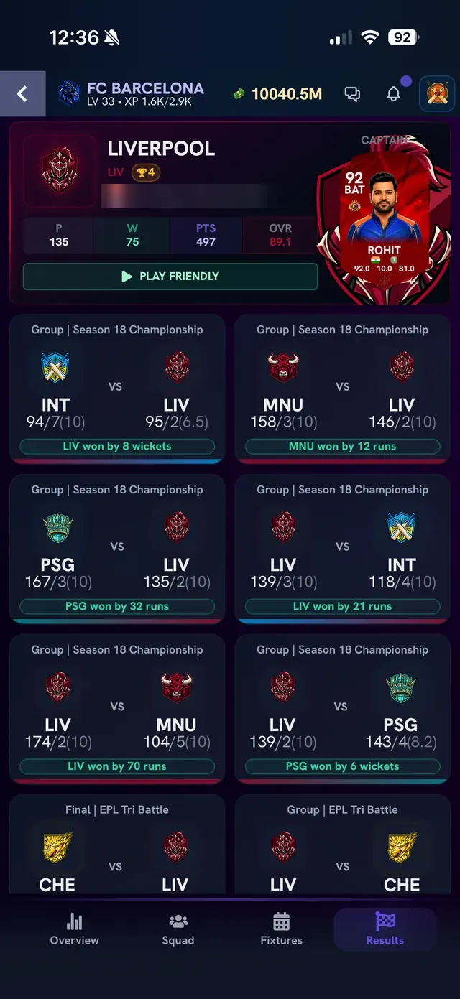

**What you see (Results tab):** finished matches with both scores and a result line such as "LIV won by 8 wickets" or "MNU won by 12 runs".

## Related

[Home and navigation screens](home-and-navigation.md), [Match day screens](match-day-screens.md)
