# Screens: Market, Signing, Scout, Offers and History

Rules behind these screens: [Signing Market](../02-market/signing-market.md), [Pool quotas](../02-market/pool-quotas.md), [Retention and releases](../02-market/retention-and-releases.md), [Transfers and selling](../02-market/transfers-and-selling.md).

## Market hub

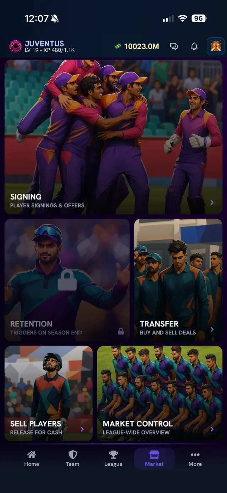

**What you see:** tiles for **Signing** (player signings and offers), **Retention** (locked, "triggers on season end"), **Transfer** (buy and sell deals), **Sell Players** (release for cash) and **Market Control** (league-wide overview).

## Signing Market

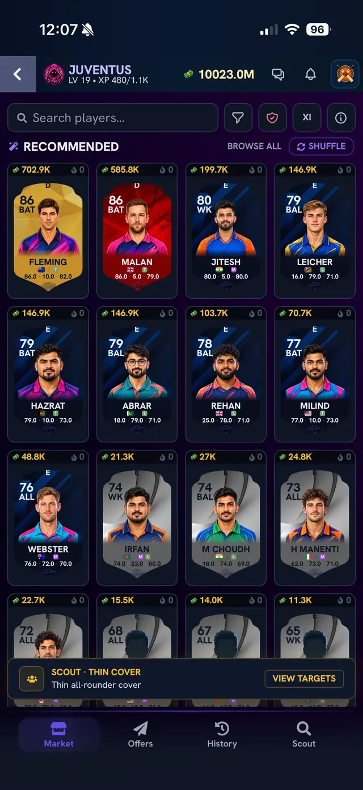

**What you see:** the **Market** tab. At the top are a search box and four buttons (filter, a shield button, **XI**, and an info button). Under it is the **Recommended** section with **Browse all** and **Shuffle**. Each card shows the price in the top left, a pool letter (for example D or E), rating and role, name and the three numbers. At the bottom a **Scout** banner (here "Thin cover - thin all-rounder cover") has a **View targets** button. The bottom tabs are **Market, Offers, History, Scout**.

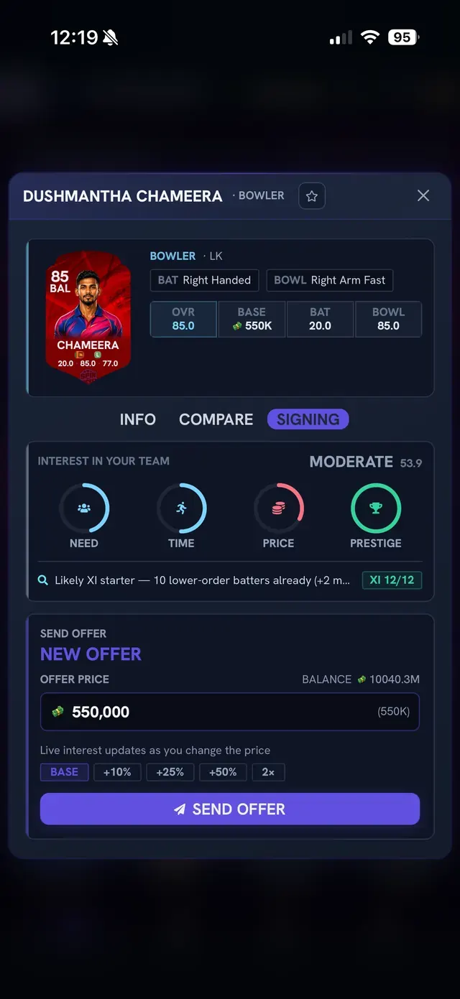

**What you see:** tap a player to open his panel. It has three tabs: **Info**, **Compare** and **Signing**. The **Signing** tab shows:

- **Interest in your team**, a rating word (for example **Moderate**) with a score, and four rings: **Need, Time, Price, Prestige**. A one-line reason sits underneath (for example "Likely XI starter - 10 lower-order batters already") and an **XI 12/12** badge that shows how the player would fit your Tactical XI balance.
- **Send offer**: an **Offer price** box (the base price is filled in), your balance, and quick buttons **Base, +10%, +25%, +50%, 2x**. "Live interest updates as you change the price."
- The **Send offer** button.

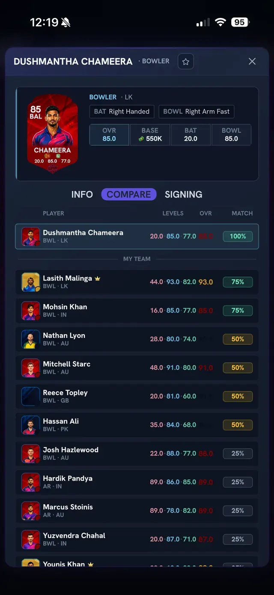

**What you see (Compare):** the player at the top and your own players underneath with their levels, overall and a **Match %** pill (100%, 75%, 50%, 25%). It shows who on your team is closest in role and rating to the player you are looking at.

## Scout

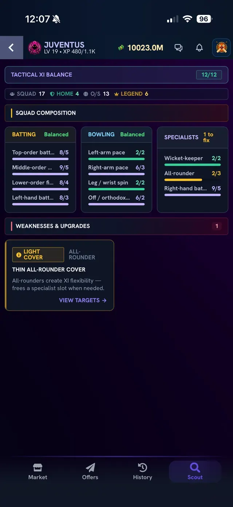

**What you see:** the **Scout** tab. It shows **Tactical XI Balance** (for example 12/12), your squad count, home players, overseas players and legends, then **Squad Composition** bars for batting (top order, middle order, lower order, left-hand) and bowling (left-arm pace, right-arm pace, leg or wrist spin, off or orthodox) and specialists (wicket-keeper, all-rounder, right-hand batter). A **Weaknesses and Upgrades** list shows gaps such as "Light cover - thin all-rounder cover" with a **View targets** link.

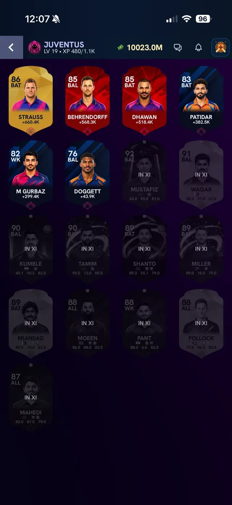

**What you see:** the targets list. Suggested players show how much they would add or cost (for example +660.4K). Players already in your XI are greyed out and marked **IN XI**.

## When the market is closed

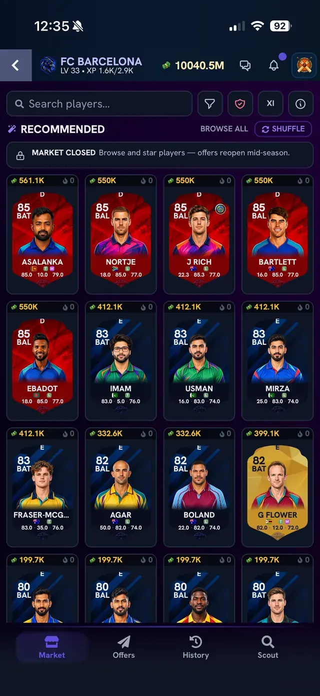

**What you see:** the same Market tab with a **Market closed** banner: "Browse and star players - offers reopen mid-season."

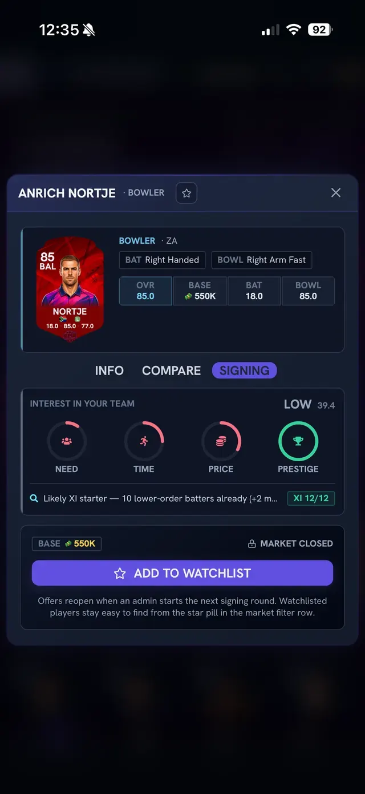

**What you see:** the player panel shows the base price, "Market closed" and an **Add to watchlist** button instead of Send offer. Text explains that offers reopen when an admin starts the next signing round and that watchlisted players are easy to find from the star pill in the market filter row.

## Offers

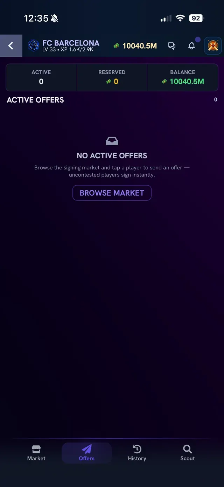

**What you see:** the **Offers** tab with three counters (**Active**, **Reserved** coins, **Balance**) and an empty list: "No active offers. Browse the signing market and tap a player to send an offer - uncontested players sign instantly."

## History

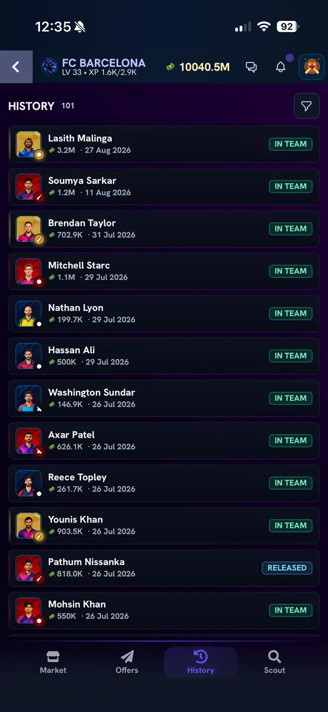

**What you see:** the **History** tab with a record count and a filter button. Each row shows the player, the price paid, the date and a status tag such as **In team** or **Released**.

## Release a player

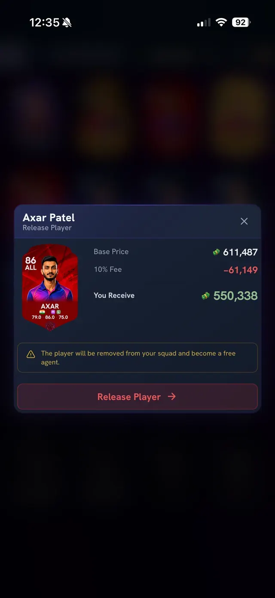

**What you see:** the **Release Player** confirmation. It lists the player's **base price**, a **10% fee** (shown in red as a deduction) and **You receive** (the amount that comes back to your balance). A warning says the player will be removed from your squad and become a free agent. The button is **Release Player**. See [Retention and releases](../02-market/retention-and-releases.md).

## Related

[Team and player screens](team-and-player-screens.md)
