# Screens: pre-match, Match Preparation, live match and results

Rules behind these screens: [League Match](../03-matches/league-match.md), [Match Preparation](../03-matches/match-preparation.md), [Match formats and scoring](../03-matches/match-formats-and-scoring.md), [Stadiums and pitches](../04-tactics/stadiums-and-pitches.md).

## Before the match

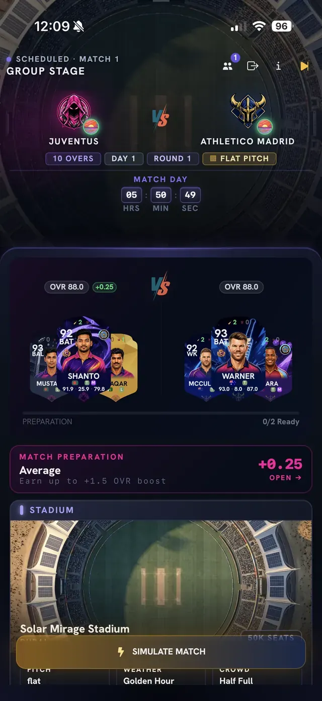

**What you see:** the pre-match hub for a scheduled match. The header shows "Scheduled - Match 1 - Group Stage", both teams, tags for **10 overs**, day, round and **pitch type**, and a **Match day** countdown (hours, minutes, seconds). Below it:

- Both teams' overall ratings (OVR) with your Focus Boost shown next to yours (for example **+0.25**), and their star players.
- A **Preparation** counter under the two teams (for example "0/2 Ready").
- A **Match Preparation** bar with a rating word (for example "Average"), your boost and the note "Earn up to +1.5 OVR boost". Tap **Open** to see the tasks.
- A **Stadium** card with name, seats, **Pitch**, **Weather** (for example Golden Hour) and **Crowd** (for example Half Full).

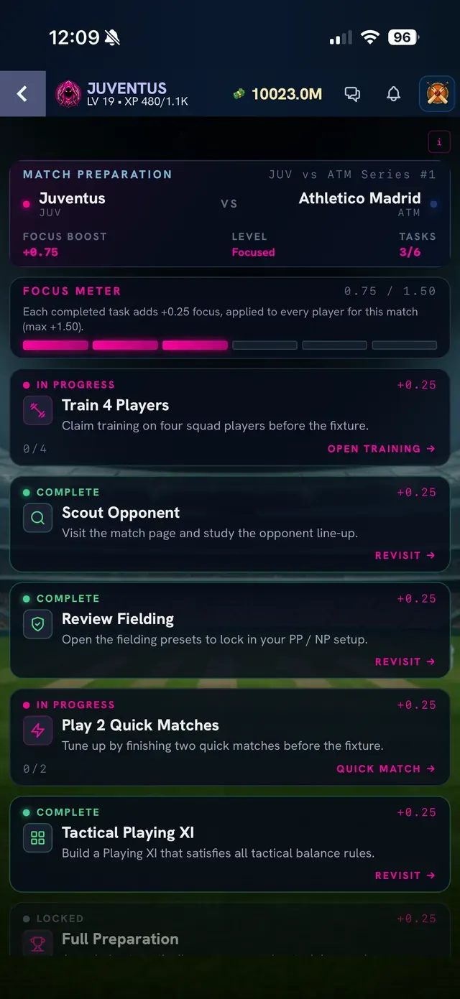

**What you see:** the **Match Preparation** page. The header shows the **Focus Boost** (here **+0.75**), your **Level** word (Focused) and **Tasks** done (3/6). The **Focus Meter** reads 0.75 / 1.50 with six segments: "Each completed task adds +0.25 focus, applied to every player for this match (max +1.50)." Six task cards follow, each worth +0.25:

1. **Train 4 Players** - claim training on four squad players before the fixture (progress 0/4, button **Open training**).
2. **Scout Opponent** - visit the match page and study the opponent line-up.
3. **Review Fielding** - open the fielding presets to lock in your Powerplay and Normal Play setup.
4. **Play 2 Quick Matches** - finish two quick matches before the fixture (0/2, button **Quick Match**).
5. **Tactical Playing XI** - build a Playing XI that satisfies all tactical balance rules.
6. **Full Preparation** - locked until the others are done.

Each card is marked **In progress**, **Complete** or **Locked**. Finished cards have a **Revisit** link.

## Live match

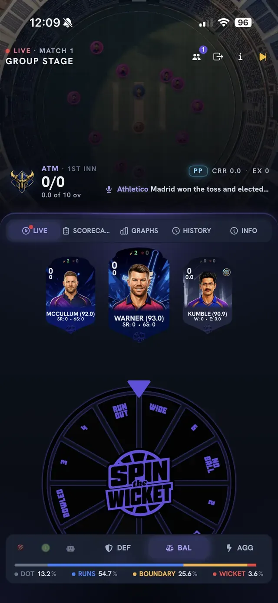

**What you see:** the **Live** tab at the start of a match. The top shows "Live - Match 1 - Group Stage", the field with fielders, the batting team's score and over count, the powerplay badge (**PP**), the current run rate, extras and a line of commentary (here the toss result). Below the tabs (**Live, Scorecard, Graphs, History, Info**) are cards for the two batters and the current bowler with their stats, then the **Spin the Wicket wheel** with the outcome segments (such as dot, runs, boundaries, wide, no ball, run out, bowled, catch out). Under the wheel are three **play style** buttons: **DEF**, **BAL** and **AGG**, and a **probability bar** that splits the next ball into **Dot, Runs, Boundary, Wicket** percentages. With **BAL** selected in this screenshot the bar reads Dot 13.2%, Runs 54.7%, Boundary 25.6%, Wicket 3.6%.

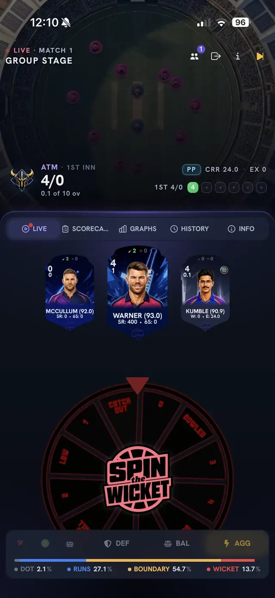

**What you see:** the same screen with **AGG** selected. The bar now reads Dot 2.1%, Runs 27.1%, Boundary 54.7%, Wicket 13.7%, so more boundaries and more wickets. The wheel turns red. These percentages are examples for one ball and change with the players, pitch and phase.

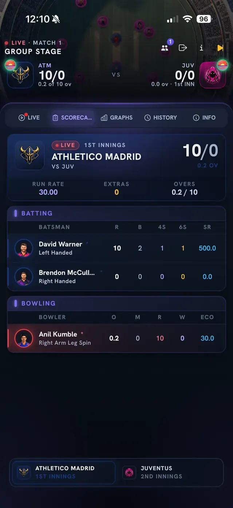

**What you see (Scorecard):** the batting side's total, run rate, extras and overs, a **Batting** table (runs, balls, fours, sixes, strike rate) and a **Bowling** table (overs, maidens, runs, wickets, economy). A small bar at the bottom switches between 1st and 2nd innings.

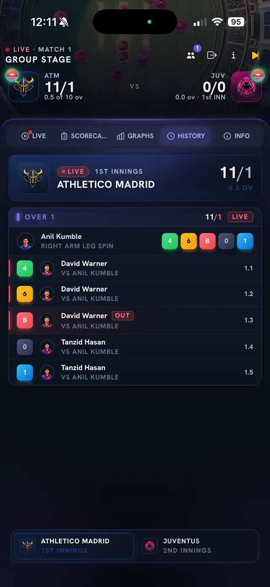

**What you see (History):** the ball-by-ball log grouped by over. The over header shows the bowler and coloured chips for each ball (for example 4, 6, B for bowled, 0, 1) and each row names the batter, the bowler and the ball number such as 1.1, 1.2. A wicket is marked **OUT**.

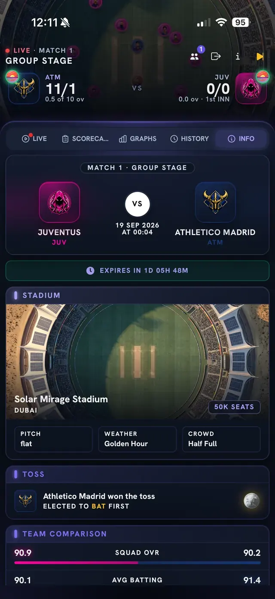

**What you see (Info):** the match header with teams and date, a countdown to the match **expiry**, the **Stadium** card (name, city, seats, pitch, weather, crowd), the **Toss** result and the elected decision, and a **Team Comparison** table (squad OVR, average batting and so on).

## Result and rewards

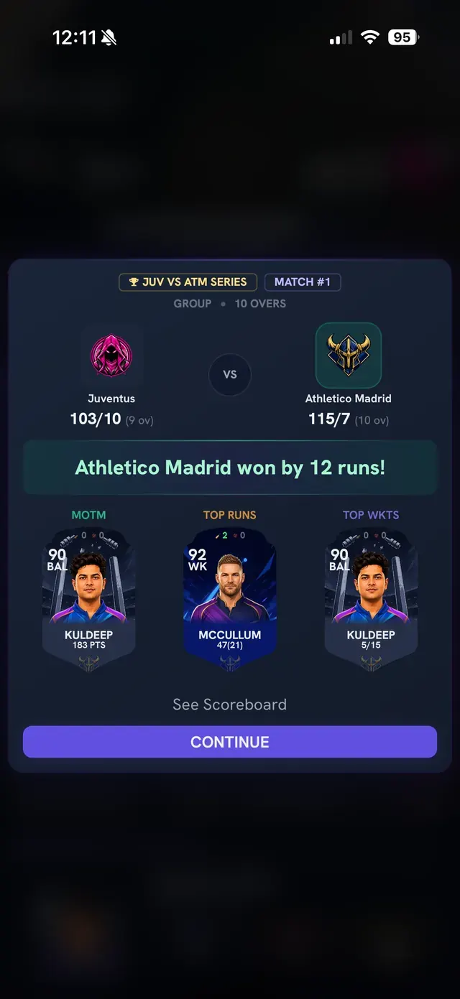

**What you see:** a result popup. It shows the series and match tag, the two scores with overs, the result line (here "Athletico Madrid won by 12 runs!") and three cards: **MOTM** (man of the match, with his points), **Top Runs** and **Top Wkts**. Buttons: **See Scoreboard** and **Continue**.

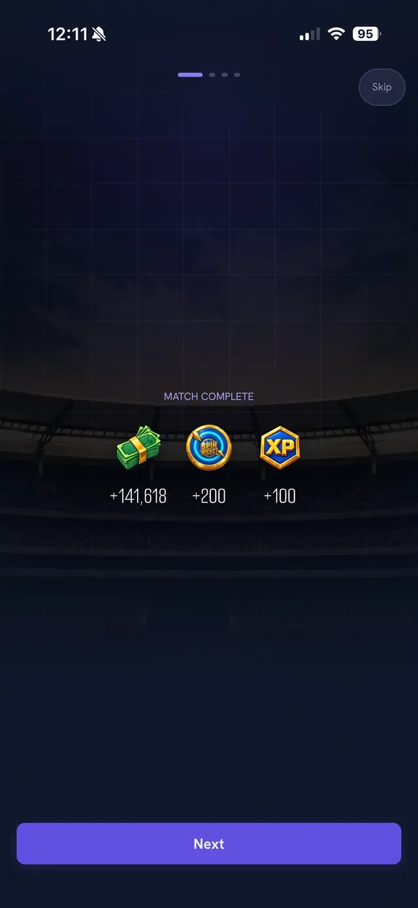

**What you see:** "Match complete" with three reward amounts: coins (for example +141,618), a second Spin The Wicket currency icon (+200) and **XP** (+100). Tap **Next** (or **Skip**) to continue. The top dots show how many reward screens there are.

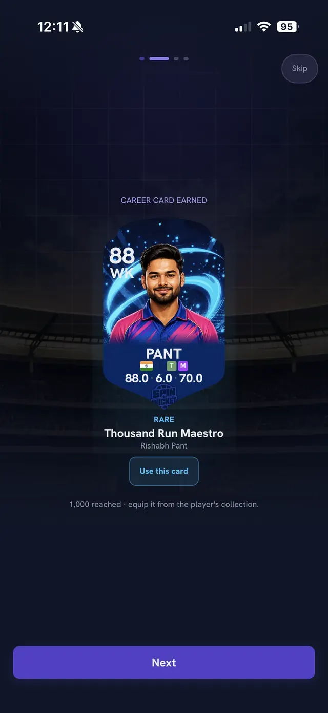

**What you see:** **Career card earned**. It shows the new card, its rarity and name (here a Rare card called "Thousand Run Maestro" for a player who reached 1,000 career runs) and a **Use this card** button, with the note that you can also equip it later from the player's collection. See the [Cards tab](team-and-player-screens.md).

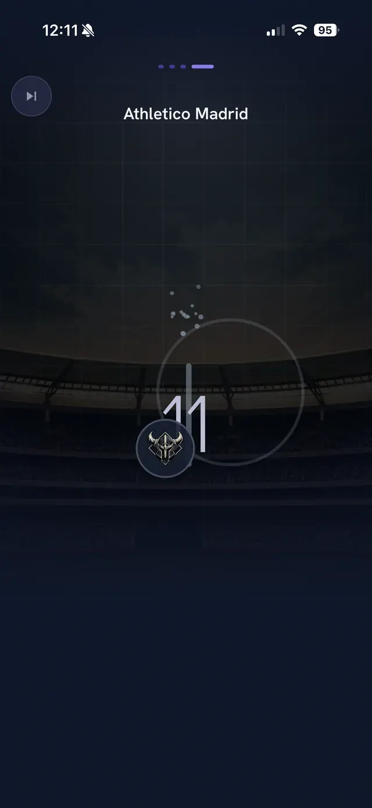

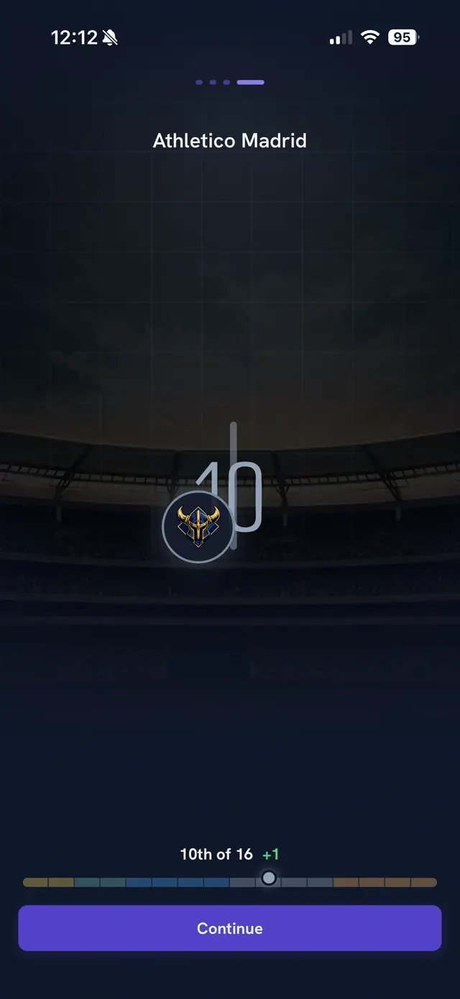

**What you see:** the last reward step is a **league rank reveal**. Your crest moves along a number line and ends on your new position (here "10th of 16" with a green +1) above a coloured bar. Tap **Continue**.

## After the match

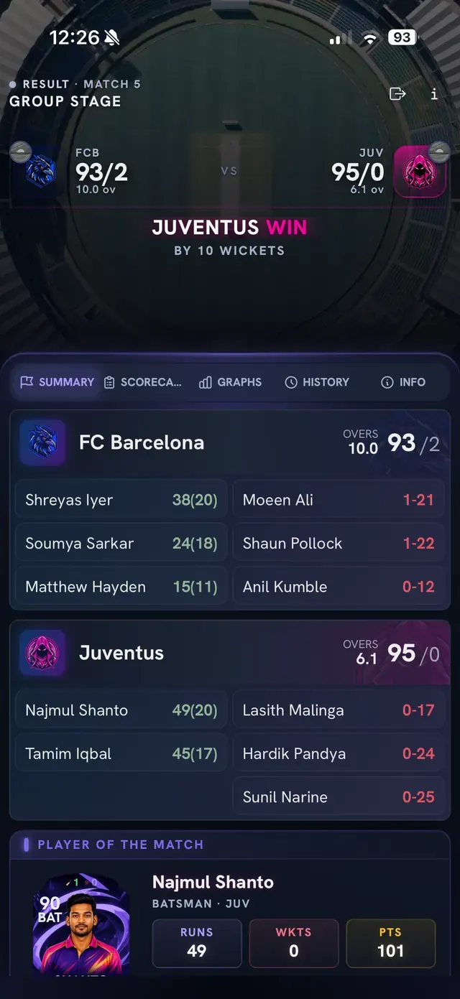

**What you see (Summary):** once a match is finished the match page header reads "Result" and shows the winner (here "Juventus win by 10 wickets"). The **Summary** tab lists each team's score and overs, the top batters and bowlers with their figures, and the **Player of the Match** card with runs, wickets and points.

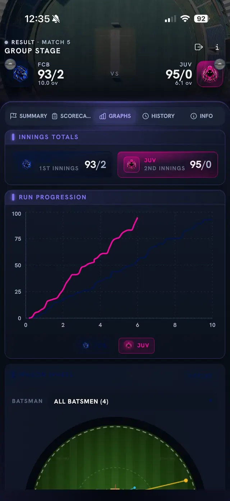

**What you see (Graphs):** **Innings Totals** for both sides, a **Run Progression** line chart (runs by over for each team) and a field chart for the batters below it (with a batter selector).

## Related

[Home and navigation screens](home-and-navigation.md), [League and tournament screens](league-and-tournament-screens.md)
