# Screens: Team hub, Playing XI, squad and player pages

Rules behind these screens: [Playing XI](../01-team/playing-xi.md), [Player roles and ratings](../01-team/player-roles-and-ratings.md), [Field Setting](../04-tactics/field-setting.md), [Training](../05-progression/training.md).

## Team hub

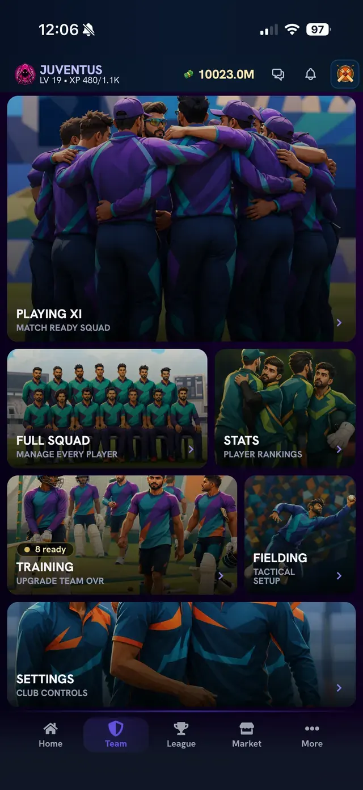

**What you see:** six tiles. **Playing XI** (match ready squad), **Full Squad** (manage every player), **Stats** (player rankings), **Training** (upgrade team OVR, with a badge such as "8 ready"), **Fielding** (tactical setup) and **Settings** (club controls).

## Playing XI

The Playing XI screen has three view buttons at the top left, followed by a team level meter and an info button. Under the pitch there are four panels: **Bench**, **Formation**, **Tactics** and **Roles**.

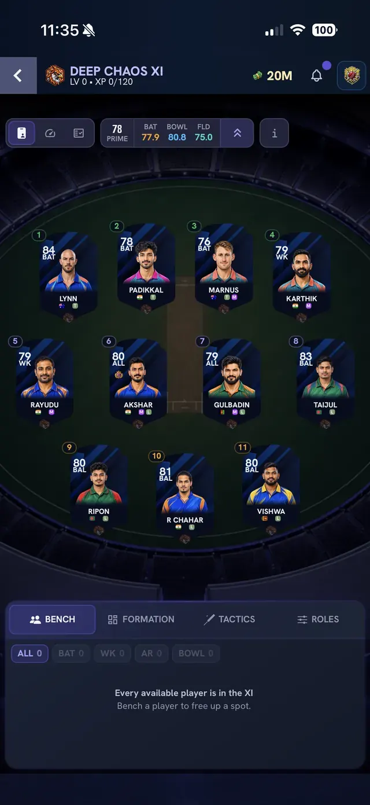

**What you see (view 1, cards):** the eleven players as cards on a pitch graphic, numbered 1 to 11 in batting order. The meter at the top shows the team level (for example **78 PRIME**) and its Batting, Bowling and Fielding numbers. The Bench panel at the bottom has filters (All, Bat, WK, AR, Bowl). When everyone is already in the XI it says "Every available player is in the XI. Bench a player to free up a spot."

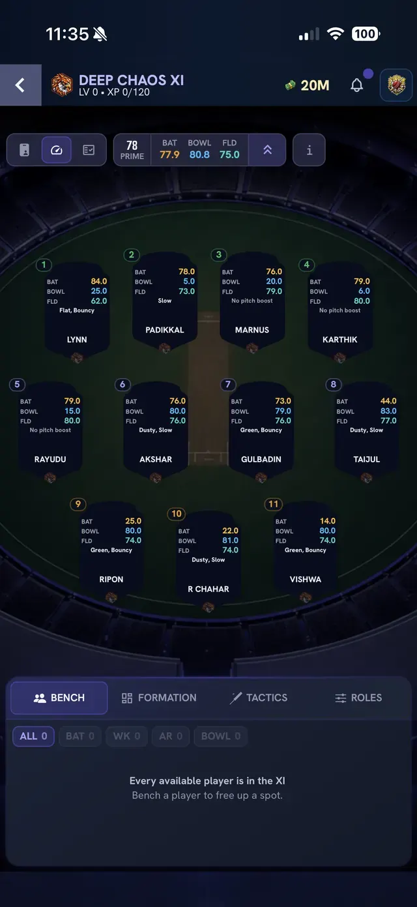

**What you see (view 2, numbers):** each slot shows the player's BAT, BOWL and FLD numbers and a small line with the **pitch boosts** that apply to that player (for example "Flat, Bouncy", "Slow", or "No pitch boost").

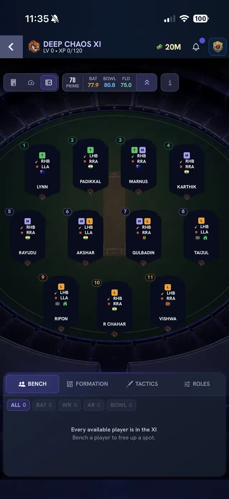

**What you see (view 3, styles):** each slot shows role badges plus the batting hand (RHB right-hand, LHB left-hand) and the bowling style (for example RRA right-arm, LLA left-arm) so you can balance left-handers and bowler types.

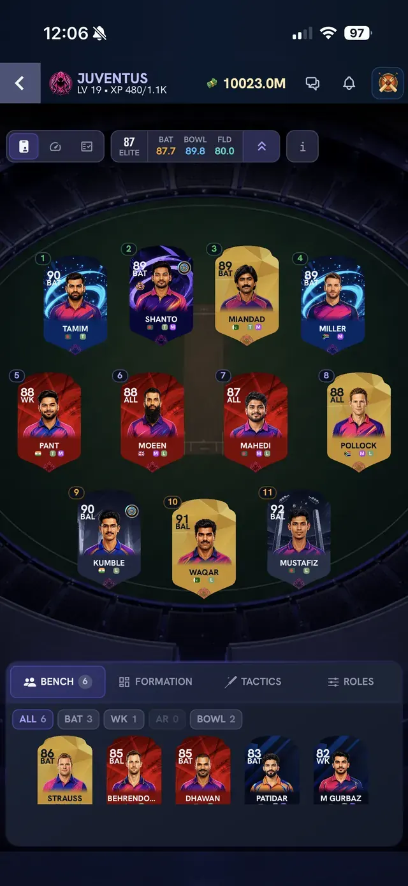

**What you see:** a stronger team. The level meter reads **87 ELITE** (Bat 87.7, Bowl 89.8, Fld 80.0). The bench has 6 players (Bat 3, WK 1, Bowl 2).

## Full Squad and Stats

**What you see:** the **Full Squad** page with a squad counter at the top right (here **17 / 17**), role filters (All, Batsman, Bowler, All-rounder, Keeper) and a grid of player cards. Each card shows rating, role, name and the three numbers (batting, bowling, fielding). Players currently in the XI have a small **XI** marker.

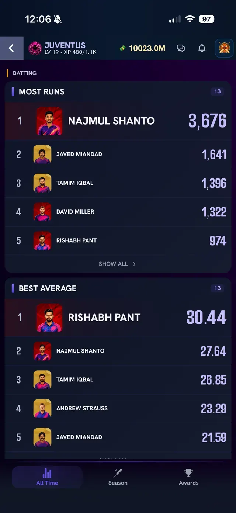

**What you see:** the **Stats** page for your team's players. Leaderboards such as **Most Runs** and **Best Average** list the top five with a **Show all** link. The bottom tabs are **All Time**, **Season** and **Awards**.

**What you see:** the **Players** list from the More menu (Explore > Players). A **Filters** button sits at the top, followed by a grid of player cards with a price under each name (for example 1.1M, 1.3M). Gold cards are legends.

## Player profile

Tapping a player opens a profile with a header card (name, role, team, country) and five bottom tabs: **Overview, Stats, Cards, Pitch, Actions**.

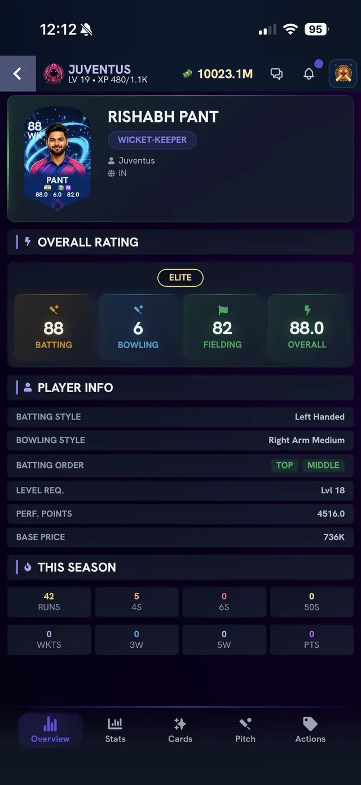

**What you see (Overview):** an **Overall Rating** block with a tier label (for example **ELITE**) and four numbers: batting, bowling, fielding and overall. Under it, **Player Info** lists batting style, bowling style, batting order zones (for example Top and Middle), the **level requirement** (for example Lvl 18), **performance points** and **base price**. Below that is a **This Season** panel with runs, fours, sixes, fifties, wickets, 3-wicket hauls, 5-wicket hauls and points.

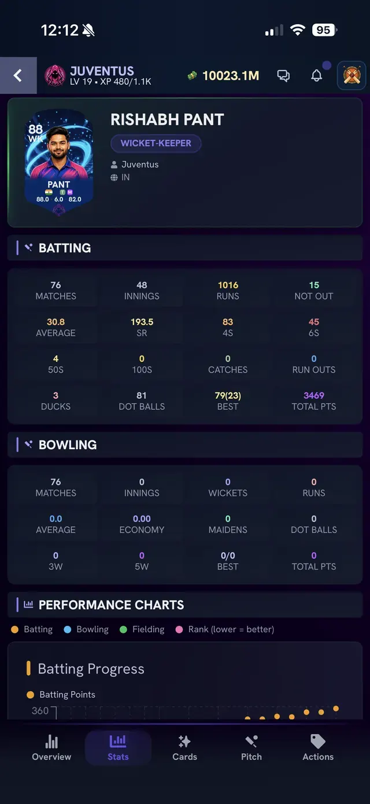

**What you see (Stats):** career **Batting** (matches, innings, runs, not outs, average, strike rate, fours, sixes, 50s, 100s, catches, run-outs, ducks, dot balls, best score, total points), career **Bowling** (matches, innings, wickets, runs, average, economy, maidens, dot balls, 3W, 5W, best, total points) and **Performance Charts** (a batting progress graph with a legend for batting, bowling, fielding and rank).

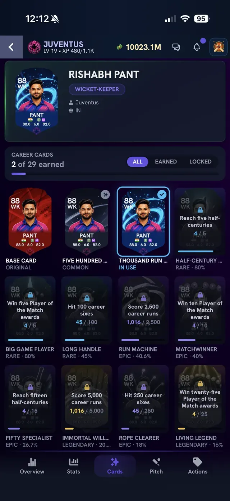

**What you see (Cards):** **Career Cards** with a counter (for example "2 of 29 earned") and filters **All / Earned / Locked**. Each card is an alternative look for the player. The first is the **Base Card (Original)**. Earned cards show their name and rarity (Common, Rare, Epic, Legendary). Locked cards show a goal and progress, for example "Reach five half-centuries 4/5" or "Score 2,500 career runs 1,016/2,500". The card marked **In use** (with a tick) is the one currently equipped.

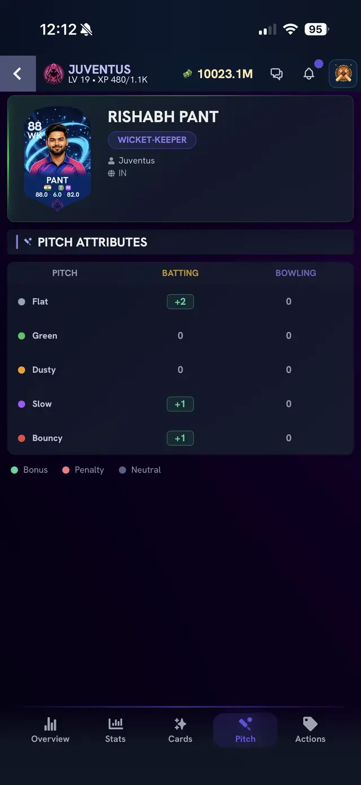

**What you see (Pitch):** a **Pitch Attributes** table with one row per pitch type (**Flat, Green, Dusty, Slow, Bouncy**) and two columns, **Batting** and **Bowling**. Each value is a bonus, penalty or zero for this player on that pitch. In this example Flat gives +2 batting and Slow and Bouncy give +1. The legend explains the colours: Bonus, Penalty, Neutral. See [Stadiums and pitches](../04-tactics/stadiums-and-pitches.md).

## Fielding presets

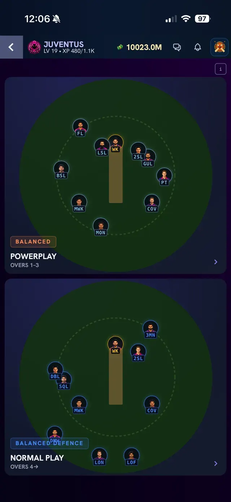

**What you see:** two field diagrams, one for **Powerplay (overs 1-3)** with the preset name **Balanced**, and one for **Normal Play (overs 4 onwards)** with the preset **Balanced Defence**. Fielder positions are shown as small player icons with position codes (for example WK, FL, LSL, MON, COV). Tap a diagram to change the preset. See [Field Setting](../04-tactics/field-setting.md).

## Training Lab

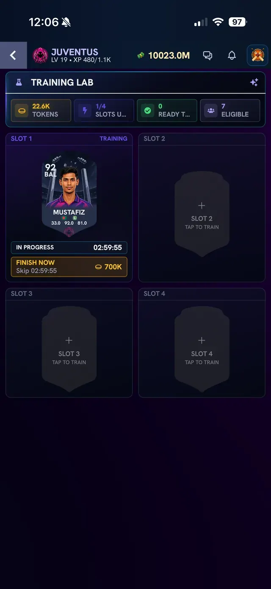

**What you see:** the **Training Lab** header with four counters: your **tokens** (for example 22.6K), **slots used** (1/4), **ready to claim** and **eligible** players (7). Below are four slots. A slot that is training shows the player card, an **In progress** label with a countdown (for example 02:59:55) and a **Finish now** button with a token price (for example 700K). Empty slots say "Tap to train". The tokens, slots and timer rules are not fully documented, see [Training](../05-progression/training.md).

## Related

[Market screens](market-screens.md), [Home and navigation screens](home-and-navigation.md)
